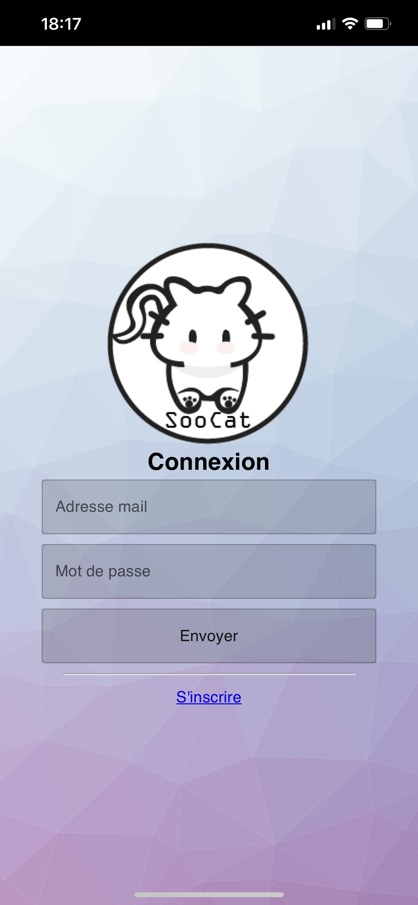
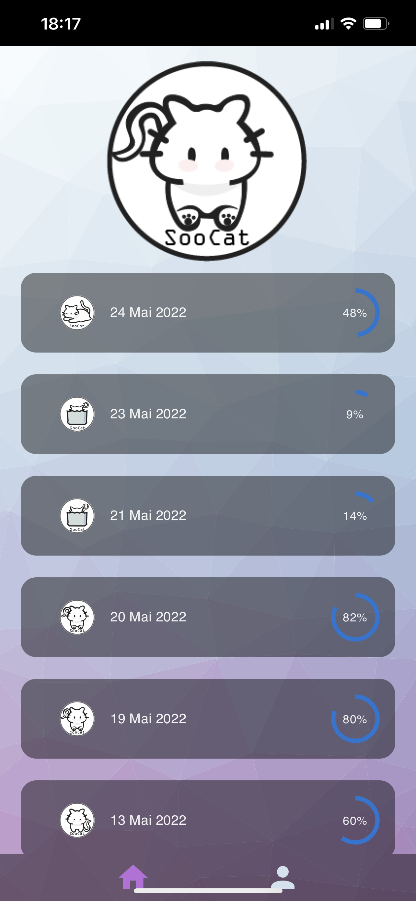
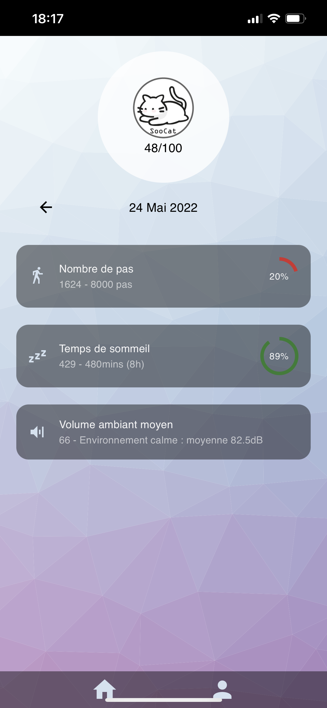
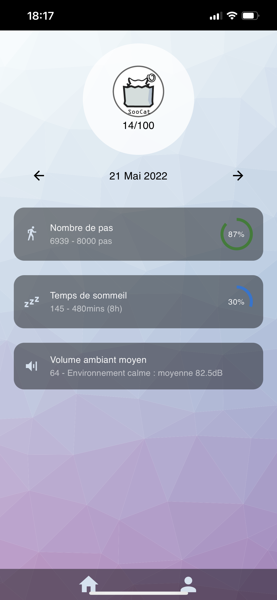
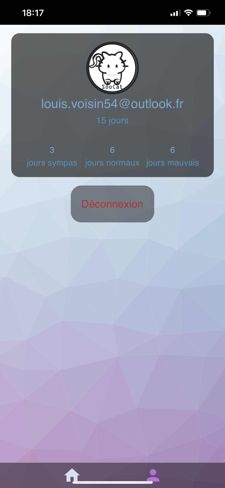

# SooCat-CadreVie

## Qui sommes-nous ?

* Nous sommes quatre étudiants en master Sciences Cognitives de Nancy.

* Louis VOISIN
* Paul DEBANO
* Marion CANDERLE
* Amélie JACOB–GUIZON

## Pourquoi ce projet ?

* Dans le cadre de notre enseignement “Technologies informatiques innovantes”, nous avons développé SooCat, une application d’E-santé.

## À propos de l’application

* SooCat est une application qui a pour vocation d’évaluer notre cadre de vie chaque jour. Elle nous accompagne au quotidien et analyse 4 types de données afin de nous donner un score global chaque jour.

## Epics et MVP

### Epics

#### Indiquer un score global évaluant le cadre de vie par jour

#### Connaître les variables physiologiques

* Sommeil
* Activités physiques

#### Connaître les variables de l’environnement

* Niveau de bruit moyen

### MVP (Minimum Viable Product)

* Application de sensibilisation sur le cadre de vie permettant une prise de conscience sur l’importance du sommeil, de l'activité physique, du niveau de bruit moyen et de la météo dans notre quotidien.

## Données recueillies

### Données physiologiques de l’utilisateur

* Sommeil
* Activité physique
* Niveau de bruit moyen

## Technologies utilisées

* React JS
* Supabase

## Captures d'écran

### Page de connexion

### Page d'accueil

### Page d'information supplémentaire

### Page d'information supplémentaire 2

### Page de compte / déconnexion

